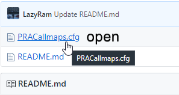
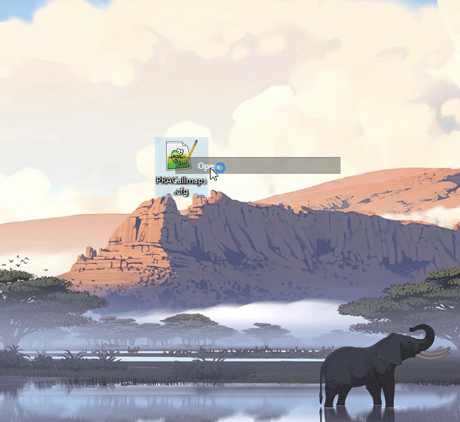
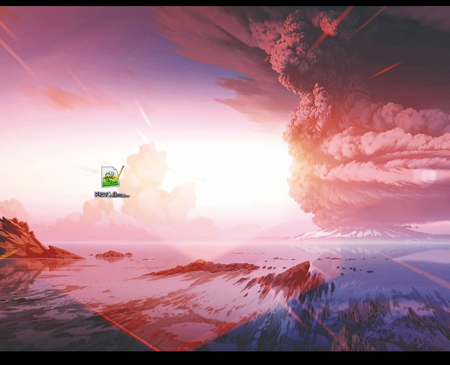

## <b>NUM ENTER - Shows Keybindings and Clears Console </b>
my steam profile is https://steamcommunity.com/id/Kiprae/ to comment a bug or just say hi

The 48 <b> BINDS ARE ON LINE 3121</b> if you want to check or change any of them -near the bottom

# Binds
### Keybindings and Commands list
- kp_enter	- Shows Keybindings and Clears Console
- kp_plus	- Shows All Give Commands/Arguments
- kp_minus	- Shows Nap Selection Console Commands

### Nade Position/Lineup binds
- Rshift     - Choose your Loaded Map
- Rctrl      - Current Map |Optionals|
- uparrow    - Terrorist Nades: Smoke, Molotov, Flash
- downarrow  - Counter Terrorist Nades: Smoke, Molotov, Flash
- leftarrow  - Next Nade Lineups
- rightarrow - Previous Nade Lineups
- NUM insert - Secondary Position for Current Lineup-

### Bot
- Insert     - places bot at crosshair
- Delete     - kicks all bots
- Home	     - All Bots Crouch
- End	     - All Bots Mimic You
- PGUP	     - Adds Bot on Terrorist Side
- PGDOWN     - Adds Bot on Counter Terrorist Side

### Crosshair Color Changer
- 7		  - Choose Crosshair Color Preset 1-5
- HOLD 8	  - hold to select/change |RED|,   While Holding use |- =| Cycle Red Tents
- HOLD 9	  - hold to select/change |BLUE|,  While Holding use |- =| Cycle Blue Tents
- HOLD 0	  - hold to select/change |GREEN|, While Holding use |- =| Cycle Green Tents
- "-"		  - Darken  Color/Tent with Multiple Presses
- "="		  - Lighten Color/Tent with Multiple Presses

- Backspace	  - clears console

### LIMITERS +
- Y	     - Shows Bomb Explosion Radius
- U	     - Become a GOD, GODS, Buddah, Vampire Damage
- I 	     - Infinite Ammo or Botomless Clip
- O	     - Render Distance and wall Collision Points
- P	     - HOLD Space to Bunny Hop
- [	     - Visualize Near Misses and bullet Hits
- ]	     - Show Bullet Impacts Data
- \ 	     - Remove Weapons and Objects on Map

### NADE
- H	     - Removes Airborn Grenades and Reset Sounds
- J	     - Disable Drawing of Particles
- K	     - Gives all Grenades to player
- L	     - Visualize Grenade Trajectory
- ;	     - Throws Recorded Nade Path

### TELEPORT
- N	     - Bomb Plant and Spawn Positions
- M	     - Teleport to Logged Positions
- ,	     - log position 1
- . 	     - log position 2
- /	     - Casts a line at Crosshair

### EXTRA
- Tab	     - Buy Menu Outside of Spawn
- Capslock   - Jump Throws Primed Nades
- F	     - Clears Decals and Inspect Weapon
- '	     - Reset Game, Commands, Alias

### FLY
- alt	     - Noclip no Collision Flying
- Ralt	     - Increase Game Speed

## HOW TO SETUP: Fast
1. Put PRACallmaps.cfg into C:\Program Files (x86)\Steam\steamapps\common\Counter-Strike Global Offensive\csgo\cfg
2. Play CSGO, Choose Prefered Map, PRACTICE WITH BOTS
3. Once Map Loads, Open Console "~" Enter "exec PRACallmaps"

## HOW TO SETUP: Detailed
1. Open PRACallmaps.cfg

##
2. Copy PRACallmaps.cfg Text

##
3. Create New File Named PRACallmaps.cfg

##
4. Past copied text into -PRACallmaps.cfg

##
5. Past Folder Location into folder explorer adress bar then Press - ENTER. Then Past PRACallmaps.cfg file into cfg Folder
> C:\Program Files (x86)\Steam\steamapps\common\Counter-Strike Global Offensive\csgo\cfg

##
6. Open CSGO, Enable Developer Console, Choose Map

##
7. Once Map Loads Choose Team, Open Console with ` Tilda, Type exec PRACallmaps

## Patch Notes
### 2.18.20
- added 1 Dust2 T Smoke and alias -OneWayShortLedge
### 2.17.20
- added TakeBSite Alias to Dust2 Grouped Aliased -Select dust2 map, type TakeBSite in Console
- added TakeASite Alias to Dust2 Grouped Aliases -Select dust2 map, type TakeASite in Console
- UPDATED 2 Dust2 T Molotov 
- organized and Optimized all dust2 nade code
- added dust2 Smokes into One Way  alias -OneWay -Select dust2 map, type OneWay in console, leftarrow rightarrow to cycle 1-9
- fixed dust2 T Smokes to properly Cycle
- added Dust2 Smokes into Jump Binds alias - JumpBind -Select dust2 map, type JumpBinds in console, leftarrow rightarrow to cycle 1-6
- edited dust2 smoke code to allow custom grouped alias
- fixed dust2 alias to now trigger when dust2 map is selected instead of working after cycling all nades
### 2.16.20
- added Multiple aliases for each Dust2 Smokes ie. SmokeLongDoorfromElevator, SLDFE, DCTSL01 -all the same
- organized and Optimized Dust2 T Smoke Code
- organized and Optimized Dust2 CT Smoke Code
- added 11 Dust2 T Nades - 3 Dust2 CT Nades
### 2.15.20
- organized Dust2 Nades Code to make it easier to add nades
- added 6 More Nades to Cache T Smokes
- made it Easier to Add Binds to Cache T Smokes
### 2.14.20
- Found 6 Z window Smokes Cache
- Fixed All T Smokes Cache Smokes
- Fixed Dust2 Smoke Name
- Fixed Show Scores and Toggle buy anywhere to show single word alias
- updated Reset Game Alias to match new Binds
### 2.13.20
- Updated Keybingings alias to New Binds
- Fixed Show All Give Commands -cleaner look -shows Commands at Top
### 2.12.20
- moved Code around to fit bind list ie. infinite ammo code is next to invulnerablty code
- changed Binds Around to Better Fit their Catagory 
- added Spawn Point Teleportations onto N extra Operions with - = keys
- fixed Bullet Impact Color Timer Penetration Extra Options can now set a timer without prenetration data forced on
- added Noclip Acceleration and More Fly Speed to Extra Options with - = keys
- added Vampire Damage Extra Options with - = keys
### 2.10.20
- fixed Infinite ammo alias IAC to properly Disable Commands
- edited code to make it easier to change binds -all commands bound to single word alias
- added Reset All Alias onto Reset Game, Commands, Alias bind (')
- added Extra Options onto Grenade Trajectory Thickness with - = keys and Dash  with - = keys + Backspace Toggle
- fixed crosshair color changer to stop showing error if selecting a preset that has not been saved yet
#### 2.9.20
- added Extra Options onto Remove Airborn Grenade H key -Stop or Reset Sound
- added Vampire Damage into Invulnerablties Cycle Extra Options with - = keys
- added Disable Death Drops to extra options of Remove Dropped Weapons and Reset Hp \ Alias
- added bind resets to Game Restart ' alias
- fixed removel airborn molotov sound bug by flushing sound on removal
- added Noclip Echo to Stop Blocking Map Position Text
- fixed Wallhack and Collision Points Bind to Properly Reset after each Rotation
- added Reset All Commands Back to default to the ' alias
### 2.8.20
- alt then Spacebar Will Reset Backspace to hide Developer PIP text
- Added Extra Options to Noclip Speed with - = keys
### 2.7.20
- Server Ips in Console are now Hidden (except when you type 'status')
- TIMESCALE - Added Extra Options onto Time Scale, - = keys to change Time Scale of held Ralt key, release Ralt Default Speed
- TIMESCALE - press Backspace to Save/Toggle Current Time Scale option change saved option with - =
- Fixed Buy Anywhere Toggle Bind
### 2.6.20
- Added Extra Options Onto Bullet Impact Color and Penetration with - = keys
- Added Extra Options Onto Wallhacks and Collision Point keybind with - = keys
- Added Extra Options Onto Infinite Ammo with - = keys
- updated Noclip to Have Spacebar Hold Your in Air Position -spacebar will still jump normally when landed
- fixed show keybindings button caused by : symbol in echo command
### 2.5.20
- added extra options onto Grenade Trajectory with - = keys
- added another type of infinite ammo into cycle
-Fixed Grenade Trajectory Timer
### 2.4.20
- Added Map Selection Commands in Categories and Alphebetical lists to the Num Minus key
### 2.3.20
- Updated Echo Binds to Be More Detailed and easier to understand for newer Players
- Overall Qualtiy of life Changes, Visally see More Detail in Developer PIP Text and What Command Cycle your ON
- added many new command cycles
- combined Wallhack and wall Clipping/Collision Points Commands into 1 Key
### 2.2.20
- fixed crosshair color changer so you wont have to make crosshaircolor1-5.log files on first use
- added invulnerablty health cycles
- added BACKSPACE command cycle. stop developer PIP text, clear console
- added bullet impacts cycle with extra impact data and timers

### 1.30.20
- added ability to drop knife
- added new bind NUM PLUS -shows all give commands in neat categories
- made it easier to copy give commands

### 11.10.19
- added Crosshair Color Changer on 7,8,9,0 with supporting -,= keys
- added  HOW TO USE: Crosshair Color Changer
- cleaned up some code

### 11.4.19
- added HOW TO USE: Nade Positions/Linup
- removed "nvm"/next view model bind
- changed keybinds to fix conflicting binds and put them in similar sections i.e. god mode next to bottomless clip
- put more frequently used binds to more easily reached keys

### 7.22.19
- added patch notes
- added 1 more dust2 flash for t and ct fctmbw -flash ct mid from B window
- fixed up dust2 smoke and flash code for easier understanding -no more starting at 0

## 
### LIST OF MAYBES
- how to edit/add, code, video? how to use config video?  general tutorial?
- list of pro settings?
- Move extra extra options (backspace) to Y? y easier to reach backsapce next to extra option - =
- save custom commands as preset
- extra option to team chat bind -all chat
- set hotkey / as teleport Presets -possible without exec?
##
### LIST OF TODO'S
- Nuke -50%, Overpass -0%, New Cache -50%, Vertigo -0%, Cobblestone -0%. -in that order-
- bot that jump, walk, run crouch past/peak set locations on each map?
- rctrl - jump boost positions, nades to take a/b, callouts, god tier nades, jump bind nades, one way smokes?
- Headphone sound test
- add echo list of nades with quality stars 1-5 for each map
- set bind to start and save nade presets
- bomb damage testing
- bind thrownade script as toggle so you dont see script text popup every exec?
- organize Nade code Dust2 100%, Mirage 0%, Cache 15%, train 0%, inferno 0%, nuke 0%, overpass 0%, vertigo 0%, cobblestone 0%
-VENT: it upsets me that github has its line management as common symbols instad of a context menu and the edit menu has diffrent FONT!!!
